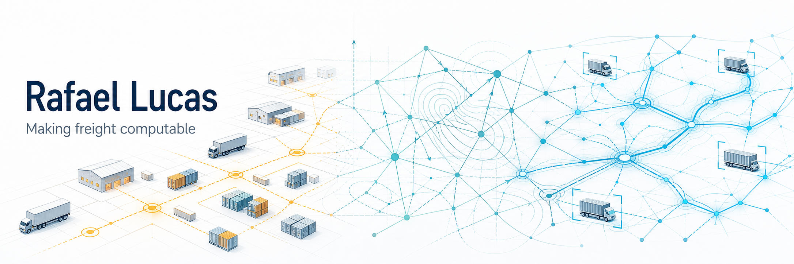

<picture>
  <source media="(prefers-color-scheme: dark)" srcset="assets/profile-banner-dark.png">
  <source media="(prefers-color-scheme: light)" srcset="assets/profile-banner-light.png">
  
</picture>

  <strong>Mathematical modeling · Data science · AI · Computer vision · FreightTech</strong>

  

## Making freight computable

For more than 25 years, I have worked where entrepreneurship, mathematical modeling, data science, and physical logistics meet.

Freight is a difficult system to model. Its decisions depend on physical constraints, time, geography, assets, capacity, service, cost, risk, and human judgment—details that rarely fit neatly into software. I like turning that kind of messy, high-stakes operational complexity into structured systems.

I developed the **7 Dimensions of Freight Optimization** as a mathematical framework for capturing those relationships and translating the nuance of freight into a language machines can process.

My current work carries that foundation into AI and computer vision, exploring intelligent transportation networks that can learn from operations, adapt to changing conditions, and scale.

My academic work spans supply chain management, organizational leadership, entrepreneurship, and business intelligence. Those disciplines provide different ways to examine a problem; more than 25 years in freight keeps the work grounded in how physical operations actually behave.

## What I work on

| Area | Questions and problems |
| --- | --- |
| **Freight and physical logistics** | How networks, assets, time, capacity, service, cost, risk, and people interact |
| **Applied intelligence** | AI, computer vision, decision support, and systems that learn from operations |
| **Mathematical modeling** | Turning operational nuance into computable structures and optimization frameworks |
| **FreightTech** | Transportation systems, telematics, data flows, integrations, and practical software |
| **Entrepreneurship** | Turning difficult operating problems into frameworks, tools, and products |

## Open-source work

Most of what I build supports operating businesses, internal systems, or ongoing research, with the underlying code often living in private GitHub repositories. This profile is where I will collect the tools, ideas, and technical projects I can share publicly. I will add to the list as that work becomes available.

### Coming Soon

I am working on a new, open-source tool that will be released soon. Stay tuned!

---

> “Science is what we understand well enough to explain to a computer.
> Art is everything else we do.”
>
> — Donald E. Knuth
